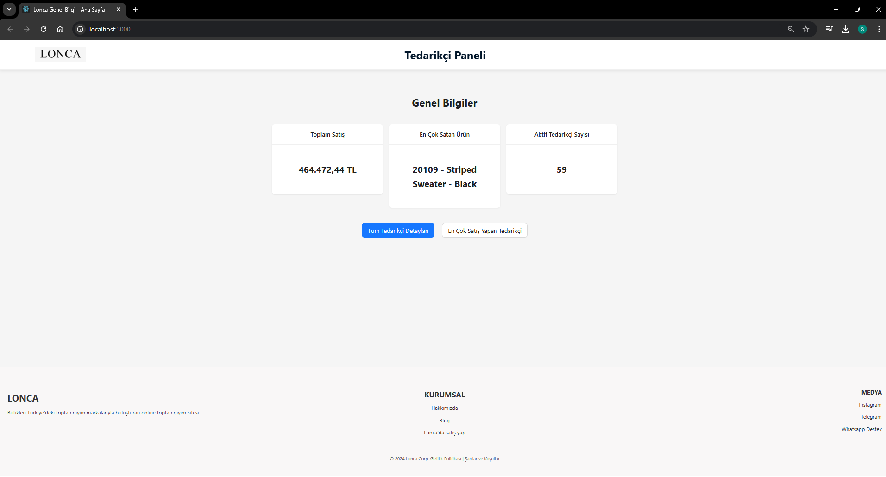
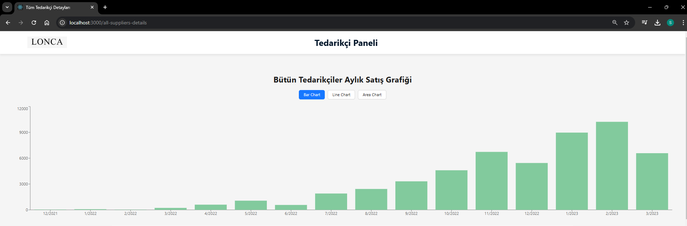
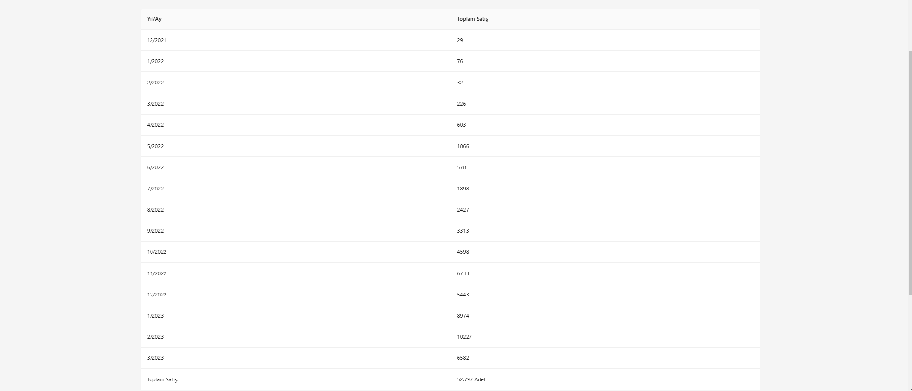
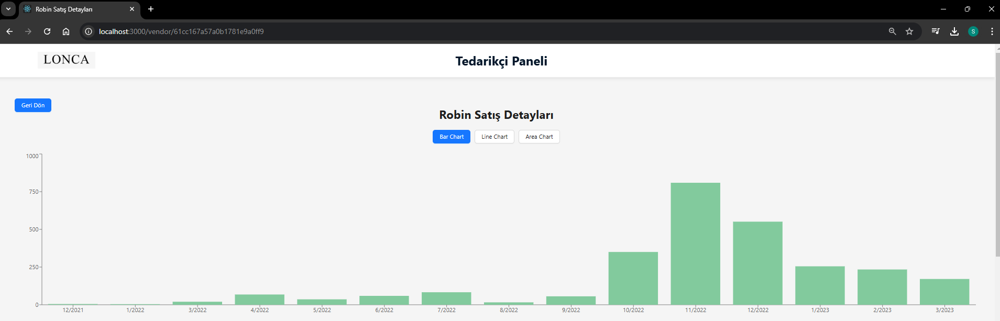
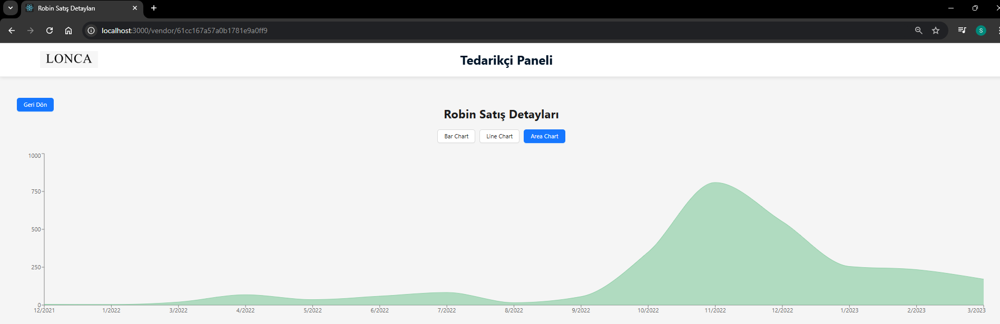
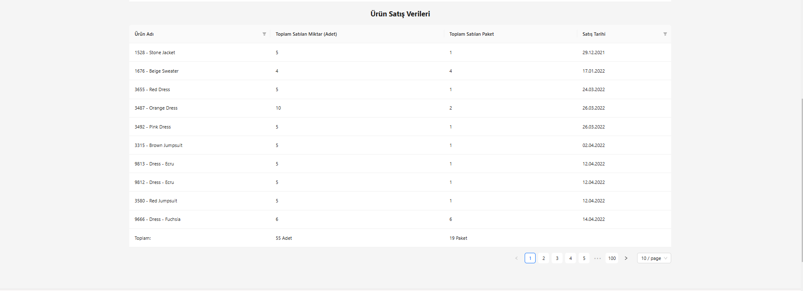
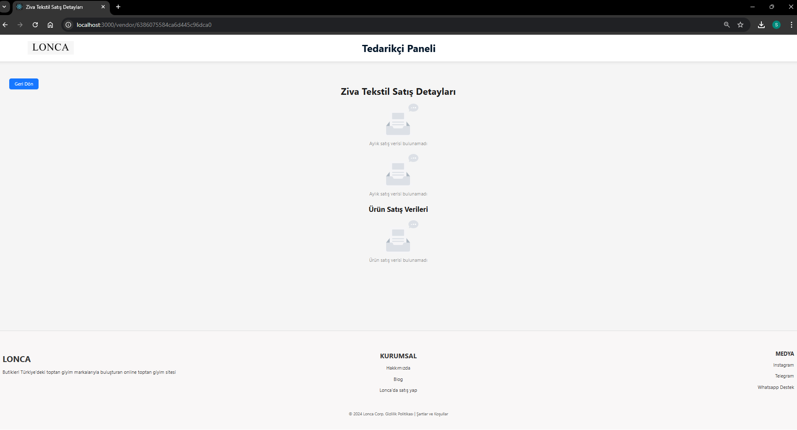
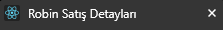

# Lonca Tedarikçi Yönetim Paneli

Bu proje, tedarikçilerin satış verilerini görselleştirmek ve yönetmek için geliştirilmiş bir yönetim panelidir. React, Node.js ve MongoDB teknolojileri kullanılarak tasarlanmıştır.

---

## 📦 Proje Özellikleri

- **Dashboard**: Toplam satışlar, en çok satan ürün ve aktif tedarikçi sayısı gibi önemli bilgiler.
- **Grafikler ve Tablolar**: Tedarikçilerin aylık satış verilerini grafiklerle görselleştirir ve detaylı tablolar sunar.
- **API Entegrasyonu**: RESTful API üzerinden dinamik veri sağlar.

---

## 🛠️ Kullanılan Teknolojiler

### **Frontend**
- React.js
- Ant Design
- Recharts

### **Backend**
- Node.js
- Express.js

### **Veritabanı**
- MongoDB (Mongoose ile)

---

##  🚀 Kurulum Adımları

### 1. Depoyu Klonlayın
```bash
git clone https://github.com/mustafasergen/Lonca.git
cd Lonca
// Backend Kurulumu
// Ana dizinde aşağıdaki komutları çalıştırın:
npm install
npm start
// Frontend Kurulumu
// client dizinine gidin ve aşağıdaki komutları çalıştırın:
cd client
npm install
npm start
```
##  📂 Proje Yapısı
```
Lonca/
├── assets/               # Image dosyaları
├── client/               # Frontend dosyaları
│   ├── src/              # React bileşenleri ve sayfalar
│   ├── public/           # Statik dosyalar
│   └── package.json      # Frontend bağımlılıkları
├── routes/               # API rotaları
├── models/               # MongoDB modelleri
├── controllers/          # API kontrolcüleri
├── .env                  # Ortam değişkenleri
├── package.json          # Backend bağımlılıkları
└── server.js             # Ana sunucu dosyası
```
---
##  📂 Veri Tabanı Yapısı

### **Tablolar**

#### 1. orders
- Sipariş bilgilerini içerir.
- Siparişte satılan ürünlerin detayları ve ödeme tarihleri yer alır.

#### 2. products
- Ürünlerin temel bilgilerini içerir.
- Ürün adı ve hangi tedarikçiye ait olduğu belirtilir.

#### 3. vendors
- Tedarikçi bilgilerini içerir.
- Tedarikçi adları ve benzersiz kimlik bilgileri bulunur.

---
##   🌐 API Dokümantasyonu
#### Dashboard
GET /dashboard
Dashboard verilerini döner.

GET /top-vendor
En çok satış yapan tedarikçiyi döner.

#### Tedarikçi Yönetimi
GET /vendors
Tüm tedarikçileri döner.

#### Satış Verileri
GET /sales/monthly-sales
Tüm tedarikçilerin aylık satış verilerini döner:

GET /sales/monthly-sales/:vendorId
Belirli bir tedarikçinin aylık satış verilerini döner.

GET /sales/vendor-product-sales/:vendorId
Belirli bir tedarikçinin ürün satış verilerini döner.

# 📊 Ekran Görüntüleri

## 🏠 HomePage


## 🏠 HomePage2


**Açıklama:**
- **En Çok Satan Tedarikçiye Direkt Geçiş:** HomePage üzerinde en çok satış yapan tedarikçiye tek bir tıklama ile gidilebilmektedir.
- **Dinamik Sayfa Başlıkları:** Web sitesinin üst kısmındaki başlıklar, her sayfa ve satıcıya göre dinamik olarak değişmektedir.
- **Bildirim Mekanizması:** Eğer backend servislerinde bir hata oluşursa, ekranın sağ üst köşesinde hata bildirimi yapılır.

---

## 🛒 Bütün Tedarikçi Görünümleri

### 📈 Bütün Tedarikçi Grafiği 1


### 📉 Bütün Tedarikçi Grafiği 2


### 📊 Bütün Tedarikçi Grafiği 3


**Açıklama:**
- **Farklı Grafik Seçenekleri:** Grafiklerde bar, line ve area gibi farklı görselleştirme seçenekleri bulunmaktadır.
- **Select Table:** Kullanıcı, tıklayıp istediği tedarikçiyi seçerek ilgili bilgilere kolayca ulaşabilir.

---

## 📦 Tedarikçi Detay Görünümleri

### Tedarikçi Detay 1


### Tedarikçi Detay 2


### Tedarikçi Detay 3


### Tedarikçi Detay 4


### Tedarikçi Detay 5


### Tedarikçi Detay 6


**Açıklama:**
- **Filtreleme Özelliği:** Veriler, tabloda dinamik olarak filtrelenebilmekte ve kullanıcının aradığı bilgilere hızlıca ulaşması sağlanmaktadır.
- **Bilgi Bulunamaması Durumu:** Eğer bir tedarikçinin bilgisi bulunmuyorsa, sistem "Bilgi Bulunamadı" şeklinde bir uyarı mesajı gösterir.
- **Tablo ve Grafiklerin Entegrasyonu:** Tedarikçi detay sayfaları hem grafik hem de tablo ile desteklenmiştir, bu sayede verilerin görselleştirilmesi ve analizi kolaylaştırılmıştır.
